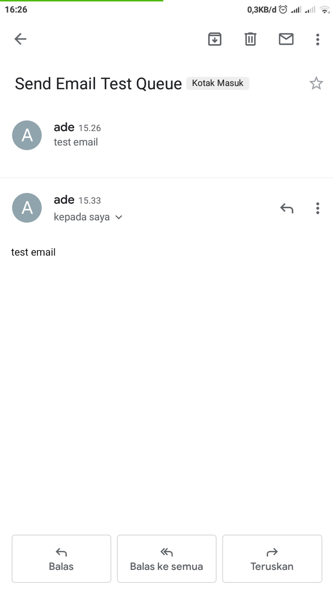

### RECIVER EMAIL SERVICE

open source code aplikasi untuk menerima data dari antrean dan mengirimkan data ke email.
<br/>

## available piture

- smtp
- queque recive
- send email

## Require

- php v.7+
- composer
- git (optional)
- RabbitMQ

## How to use

ubah .example.env menjadi .env dan masukan semua kebutuhan sistem ke dalam variable yang ada di dalam file .env

1. Clone Project

```
$git clone https://github.com/adehikmatfr/service-recive-email.git
```

2. Install plugin

```
$cd service-recive-email
$compouser install
```

3. Run Project

```
$php index.php
```

Notice : pastikan anda telah menjalankan RabbitMQ .<br>
jika stap yang anda lakukan sesuai maka akan seperti ini :


kemudian kirim antrean dari service-sendemail . anda bisa mendownload source code dari link ini
[https://github.com/adehikmatfr/service-email.git](service-email) <br>

jika antean sudah dikirim maka akan seperti ini :


emailpun sudah terkirim .



karna ini menggunakan arsitektur microservice jadi ketika recive-email ada kendala data email akan tetap masuk ke dalam antrean di rabbitmq.

### Join with me :

[][youtube]
[][linkedin]
[][instagram]

<br />

[linkedin]: https://www.linkedin.com/in/adehikmat
[youtube]: https://www.youtube.com/channel/UCpZ-2cuPYGKO-LSR2YHTrAg/
[instagram]: https://www.instagram.com/adehikmat_fr/
[facebook]: https://www.facebook.com/adehikmat.fanzipauzan
